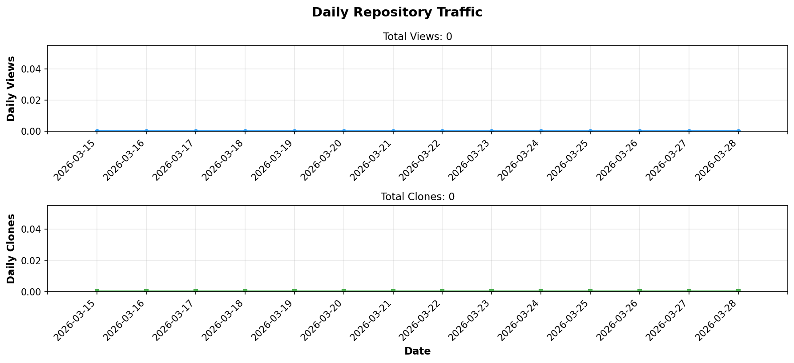
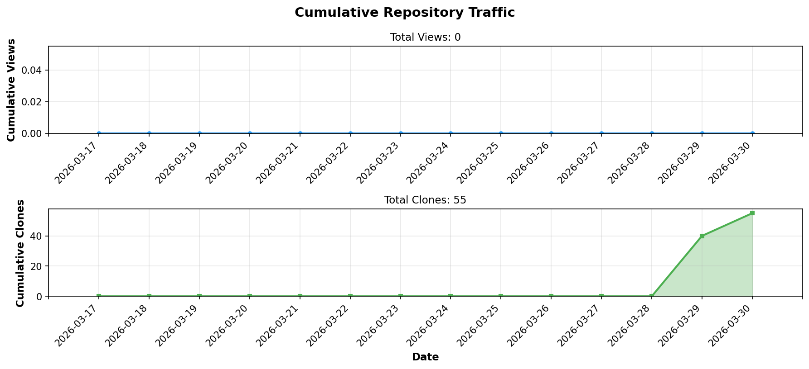

# ai2ia - AI to instruct AI

<div align="center">

[JA](docs/ja/README.md) | [FR](docs/fr/README.md) | [IT](docs/it/README.md) | [DE](docs/de/README.md) | [RU](docs/ru/README.md) | [AR](docs/ar/README.md)

**Prompt optimization and parallel AI response comparison tool**

[](https://github.com/BonoJovi/ai2ia/releases)
[](https://www.rust-lang.org/)
[](https://tauri.app/)
[](LICENSE)

</div>

ai2ia is a desktop application that lets you write prompts, optimize them for different AI models, and compare responses side-by-side. Built with [Tauri 2](https://tauri.app/) (Rust + HTML/CSS/JS).

<!-- STATS_START -->
## 📊 Repository Statistics

<div align="center">

### 📈 Daily Traffic



### 📊 Cumulative Traffic



| Metric | Count |
|--------|-------|
| 👁️ **Total Views** | **0** |
| 📦 **Total Clones** | **0** |

*Last Updated: 2026-03-28 06:29 UTC*

</div>
<!-- STATS_END -->

---

## Features

- **Multi-AI Comparison** - Send prompts to OpenAI, Anthropic, Google AI, and xAI simultaneously and compare responses in parallel panels
- **Prompt Optimization** - Automatically optimize your prompts for each AI model before sending
- **AI Prompt Generation** - Describe your idea roughly and let AI generate a polished prompt for you
- **Drag & Drop Panels** - Rearrange AI response panels by dragging
- **Flexible Layout** - Switch between 2, 3, or 4 column layouts
- **7 Languages** - English, Japanese, French, Italian, German, Russian, Arabic (including RTL support)
- **Dark/Light Theme** - Toggle between dark and light mode
- **Secure API Key Storage** - API keys are stored locally on your system

## Supported AI Providers

| Provider | Models |
|----------|--------|
| OpenAI | GPT-4o, GPT-4o-mini, GPT-4-turbo |
| Anthropic | Claude Sonnet 4, Claude Opus 4, Claude Haiku 4.5 |
| Google AI | Gemini 2.5 Flash, Gemini 2.5 Pro |
| xAI | Grok-3, Grok-3-mini |

## Prerequisites

- [Rust](https://rustup.rs/) (latest stable)
- [Node.js](https://nodejs.org/) (v18+)
- [pnpm](https://pnpm.io/)
- System dependencies for Tauri: see [Tauri Prerequisites](https://v2.tauri.app/start/prerequisites/)

## Build

```bash
# Install Node dependencies
pnpm install

# Development
pnpm tauri dev

# Production build
pnpm tauri build
```

## Project Structure

```
ai2ia/
  src/              # Rust backend
    main.rs         # Entry point
    lib.rs          # Tauri app setup
    commands.rs     # Tauri command handlers
    modules/
      ai_client.rs  # AI provider API clients
      api_keys.rs   # API key management
  res/              # Frontend
    index.html      # Main UI
    index-ar.html   # Arabic (RTL) UI
    css/            # Stylesheets
    js/             # JavaScript modules
  scripts/          # Release scripts
```

## Configuration

On first launch, go to **Settings** and enter your API keys for the providers you want to use. Keys are stored securely in your local data directory.

## License

[MIT](LICENSE) - Copyright (c) 2026 Yoshihiro NAKAHARA
